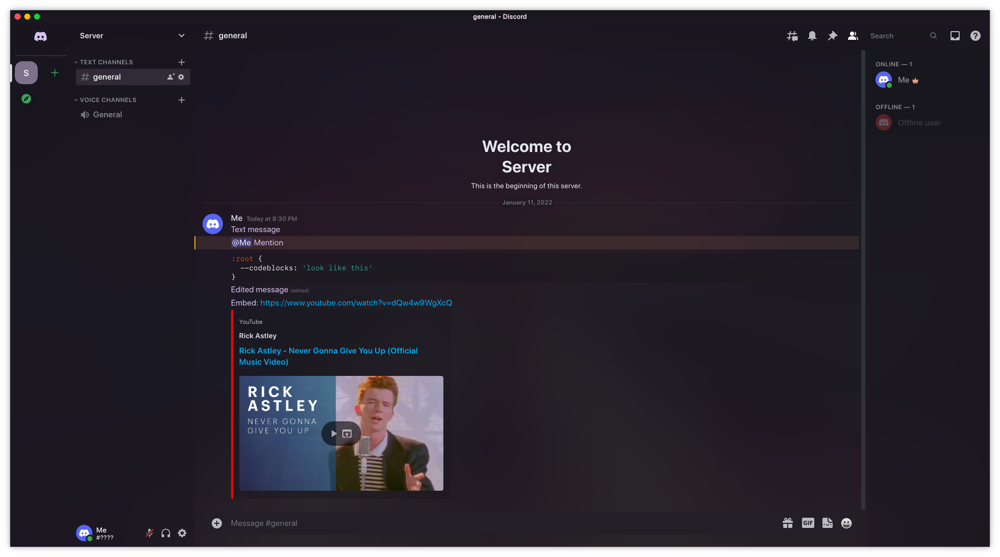

<div align="center" justify="center">

<h2> 🔮 Purple Dark Glass 🔮 </h2>

A Discord theme inspired by the colors from the [ZorinOS purple dark theme](https://github.com/ZorinOS/zorin-desktop-themes/tree/master/ZorinPurple-Dark) with transparency in mind!



</div>

# 🔍 Transparency

It is recommended to use [Vesktop](https://github.com/Vencord/Vesktop) as it currently supports setting the window to transparent

## 🪟 Windows

Select a transparency option inside Vesktop settings

## 🐧 Linux

Run this in the console (<kbd>CTRL</kbd>+<kbd>SHIFT</kbd>+<kbd>I</kbd>)
```js
Vesktop.Settings.store.transparencyOption = 'yes'
```
then fully restart Vesktop.

> [!IMPORTANT]  
> You now have to make sure your compositor also blurs the window. Solutions that I'm aware of:
> 
> [Force Blur Script for KDE Plasma 5](https://github.com/esjeon/kwin-forceblur)  
> [Force Blur Effect for KDE Plasma 6](https://github.com/taj-ny/kwin-forceblur)

# ⚠️ Notes

- Purple Dark Glass is a dark theme only, using light mode will result in the default discord theme being used

# 📥 Installation

- [Vencord](https://github.com/Vendicated/Vencord)
  - Open settings, click on Themes under Vencord then click on Online Themes
  - Add a new line with this content: `https://d3sox.me/Purple-Dark-Glass/purple-dark-glass.theme.css`
- [OpenAsar](https://github.com/GooseMod/OpenAsar)
  - Open settings, scroll to the bottom on the left and click on the OpenAsar version, then click on Theming
  - Add a new line with this content: `@import url(https://d3sox.me/Purple-Dark-Glass/purple-dark-glass.theme.css);`

- [BetterDiscord](https://github.com/BetterDiscord/BetterDiscord)

  - Drop the [`purple-dark-glass.betterdiscord.theme.css`](https://raw.githubusercontent.com/D3SOX/Purple-Dark-Glass/master/purple-dark-glass.betterdiscord.theme.css) in your themes folder

- [Replugged](https://github.com/replugged-org/replugged)
  - Open your themes folder and clone this repository
    ```sh
    git clone https://github.com/D3SOX/Purple-Dark-Glass
    ```

# 🧩 Recommended complementary projects

- Plasma color theme: [Purple Dark Plasma Colors](https://github.com/D3SOX/Purple-Dark-Plasma-Colors)
- VSCode theme: [SynthWave '84](https://github.com/robb0wen/synthwave-vscode)
- GTK theme: [ZorinOS purple dark theme](https://github.com/ZorinOS/zorin-desktop-themes/tree/master/ZorinPurple-Dark)
- Spotify theme: [Ziro](https://github.com/schnensch0/ziro/tree/main/preview#purple-dark)
